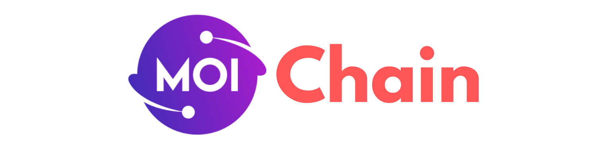
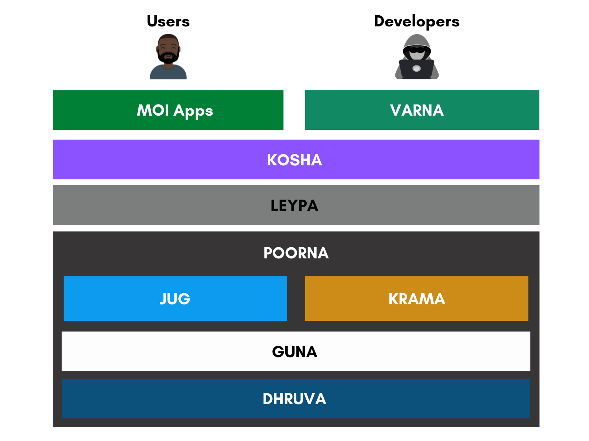

# MOI Chain
### Official Go Implementation of the MOI Protocol.

**MOI** is the **World's First Personalized Global Value Network.**  
www.moi.technology

### What is MOI?
- Enables Complete User Ownership and Control
- Empowers the **New Internet of Value**
- Integrates **Context** as a foundational computational dimension of P2P Networks
- Introduces a new personalized multidimensional value structure for participants, measured using **Total Digital Utility (TDU)**

## MOI Bird View

### VARNA
VARNA is a MOI-native toolchain and an ecosystem for application developers offering tools to develop, deploy and maintain
apps on the MOI network (called MOIApps). It also provides an accurate fee metering mechanism for different execution types
and offers a series of tools for code analysis and network simulation.

### KOSHA
KOSHA is an application middleware that can be used by clients to communicate with MOI infrastructure. It will also be made
available as mobile and web SDKs.

### LEYPA
LEYPA is the network middleware that connects business logic across traditional infrastructure and peer-to-peer networks. It
acts as a hub for achieving interoperability between hybrid environments.

### POORNA
POORNA is a context-aware peer-to-peer overlay network that facilitates fast and reliable communication among nodes in the
network. Context-driven capabilities of POORNA also help to achieve Modulated Trust by creating personalized clusters in
an optimized manner. It is also responsible for facilitating multi-party computation clusters.

### JUG
JUG is a context-aware compute engine to facilitate computation on an open network across heterogenous personalized execution
environments. It is a pioneer in Context Unified Compute Architecture (CUCA) for all eligible devices.

### KRAMA
KRAMA is a family of intelligent consensus algorithms required to achieve contextual singularity using Modulated Trust 5 in any
open or closed network. It facilitates personalized context-aware consensus and establishes verifiable trust in open networks,
thereby providing high throughput without compromising the benefits of decentralization.

### GUNA
GUNA is a context-aware state manager responsible for managing value states in the MOI network. It handles the state of participants,
interactions, and applications along with their context and value. Apart from handling state, Guna also supports analytical representations
of data in the value space using Coalescence to form patterns out of contextual singularities in the form of Tesseract Lattice or a Tesseract Grid.

### DHRUVA
DHRUVA is a context-aware storage engine for handling object and block storage of data used in the MOI network. It supports a pluggable interface
for multiple key-value databases and enables the persistence of network-wide content-addressable data.

## Documentation 📝
If you'd like to learn more about the Moichain, how it works and how you can use it for your project, 
please check out the **[Moichain Documentation](https://moichain-docs.pages.dev/)**.

## Code Owner
- Rahul Lenkala
- Manish Meganathan
- Sahith Narahari 

## Contributors
- Ganesh Prasad Kumble
- Sudheer Singam Reddy
- Karthik Nallabolu
- Gokul R
